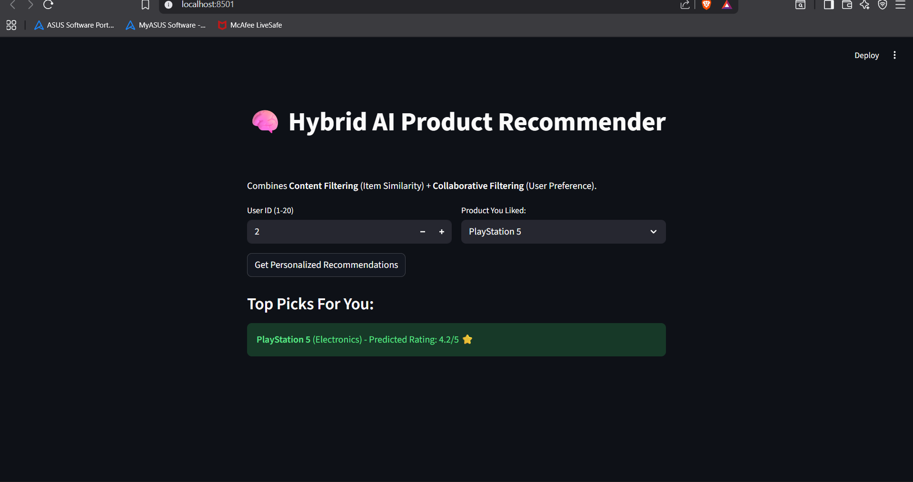
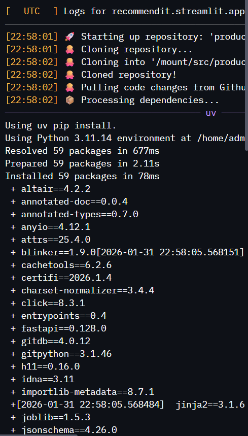

# 🛍️ Hybrid AI Product Recommendation System


A scalable **Hybrid Recommendation Engine** that combines **Content-Based Filtering** (product similarity) and **Collaborative Filtering** (user personalization) to deliver accurate product suggestions.

This system solves the **Cold Start Problem** by falling back to content similarity when a new user has no interaction history.

🔗 **Live Repo:** [https://github.com/1ndevvv/Product-Recommendation-system](https://github.com/1ndevvv/Product-Recommendation-system)

---

## 🚀 Features

* **🧠 Hybrid AI Logic:** Merges **TF-IDF** (Text Analysis) with **SVD** (Singular Value Decomposition) for maximum accuracy.
* **❄️ Cold Start Handling:** Automatically detects new users/products and switches strategies so recommendations never fail.
* **⚡ Real-Time API:** Built with **FastAPI** for high-performance serving.
* **💻 Interactive UI:** A clean frontend dashboard built with **Streamlit**.
* **📊 Synthetic Data Generator:** Includes a script to generate realistic user-product interaction data for testing.

---

## 🛠️ Tech Stack

* **Language:** Python 3.10+
* **Machine Learning:** Scikit-Learn, Pandas, NumPy
* **Backend:** FastAPI, Uvicorn
* **Frontend:** Streamlit
* **Data Processing:** TF-IDF Vectorization, Truncated SVD

---

## 📸 Project Gallery

### 1. The Interactive UI
*Simple and clean dashboard for users.*


### 2. The Code Structure
*Professional folder architecture separating Logic (src), API, and Frontend.*


### 3. Backend Execution
*FastAPI server running in real-time.*


## 🔗 Live Demo
*Note: This link only works if you are running the app on your own machine.*
[👉 Open Local App (http://localhost:8501)](http://localhost:8501)


## 📂 Project Structure

```bash
AI-Product-Recommender/
│
├── api/
│   └── main.py              # FastAPI Backend (The Brain)
│
├── frontend/
│   └── app.py               # Streamlit Dashboard (The Face)
│
├── src/
│   ├── preprocessing.py     # Data Cleaning
│   ├── models.py            # AI Model Definitions (SVD & TF-IDF)
│   └── recommender.py       # Hybrid Logic Implementation
│
├── data/
│   ├── generate_data.py     # Script to create dummy data
│   └── products.csv         # The dataset (generated)
│
├── requirements.txt         # Project Dependencies
└── README.md                # Documentation